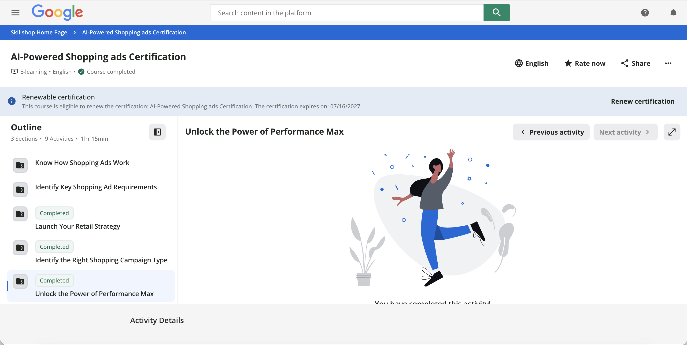

## Skillshop Module Completion

<!-- GAP: Insert your screenshot below. Save it as
     images/module-completion-part2.png in your project folder
     (create an images/ folder next to this .qmd if you don't have one yet). -->

The screenshot below shows the Skillshop course outline with all three assigned modules marked **Completed**: Launch Your Retail Strategy, Identify the Right Shopping Campaign Type, and Unlock the Power of Performance Max.

## CPP Farm Store Application Reflection

**What retail campaign objective would make the most sense for CPP Farm Store?**

CPP Farm Store sits at the intersection of an online storefront (cppfarmgifts.myshopify.com) and a physical, on-campus retail location, so the campaign objective should be an omnichannel one rather than a pure online-sales play. Google's retail campaign framework treats "drive online sales" and "drive store visits" as distinct objectives, but for a campus-based farm store the two goals reinforce each other: students, faculty, and local shoppers may browse gift baskets online and then pick them up in person, or discover the store in person and later order online for a gift. An objective built around omnichannel growth, using Performance Max's ability to optimize toward both conversions and store visit signals, would make the most sense.

**Which CPP Farm Store products or product categories should be prioritized in a campaign?**

Given the group's work building the gift basket concept, the campaign should prioritize the curated gift basket bundles as the hero category, since they carry higher margins and are more visually distinctive than individual items. Within that, seasonal and occasion-based baskets (holiday, graduation, welcome-week) should be prioritized first because they have built-in urgency and searchability. Secondary priority should go to the standalone farm products (honey, produce, plant starts) that make up the baskets, since these can pull in shoppers searching for individual items who then get upsold into a bundle through Shopping ad recommendations.

**Which Shopping campaign type or Performance Max approach seems most appropriate, and why?**

Performance Max is the strongest fit for CPP Farm Store. Because the group is working with a small, still-developing product catalog and limited historical conversion data, a Standard Shopping campaign alone would offer more manual control but far less reach. Performance Max solves the discovery problem by using the product feed to automatically place ads across Search, Display, YouTube, Discover, Gmail, and Maps, which matters for a lesser-known campus brand that needs broad top-of-funnel visibility before it can rely on branded search demand. Performance Max's local/store-visit asset groups also let the campaign support the in-person side of the business, which a Shopping-only campaign cannot do.

**What channels or customer touchpoints should the campaign support?**

The campaign should support the Shopify storefront as the primary online conversion point, Google Maps and Local catalog listings to drive foot traffic to the physical Farm Store, and Display/YouTube placements to build awareness with the campus community ahead of gift-giving seasons. Email capture through Performance Max's Gmail placement could also feed the group's broader retention efforts.

**What KPIs should CPP Farm Store track to evaluate success?**

Key metrics should include Return on Ad Spend (ROAS) and cost per conversion for the online store, conversion rate on the gift basket product pages, and store visit conversions to measure offline impact. Click-through rate by asset group would help the team see which creative and audience signals are performing best within Performance Max, and impression share would indicate whether the campaign is reaching enough of the available campus audience.

**How can your group apply what you learned to the Campaign Plan, Creative Brief, or Dashboard deliverables?**

This module directly informs the group's Campaign Plan by clarifying that the recommended structure should be Performance Max with an omnichannel objective, built around a gift-basket-first product feed. It also shapes the Creative Brief, since Performance Max asset groups require a range of creative inputs (images, short and long headlines, video) rather than the single product feed that Standard Shopping relies on. Finally, it gives the Dashboard a clear KPI framework: ROAS, conversion rate, store visits, and channel-level CTR, so the group's measurement plan is consistent with what was actually set up in the campaign.

## Appendix

<!-- GAP: Replace with your actual GitHub Pages and repo URLs after publishing -->

- **GitHub Pages:** [link here](https://espinacecilia-design.github.io/REPO-NAME/)
- **GitHub Repo:** [link here](https://github.com/espinacecilia-design/REPO-NAME)
